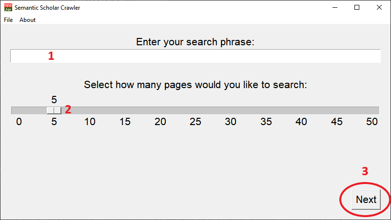
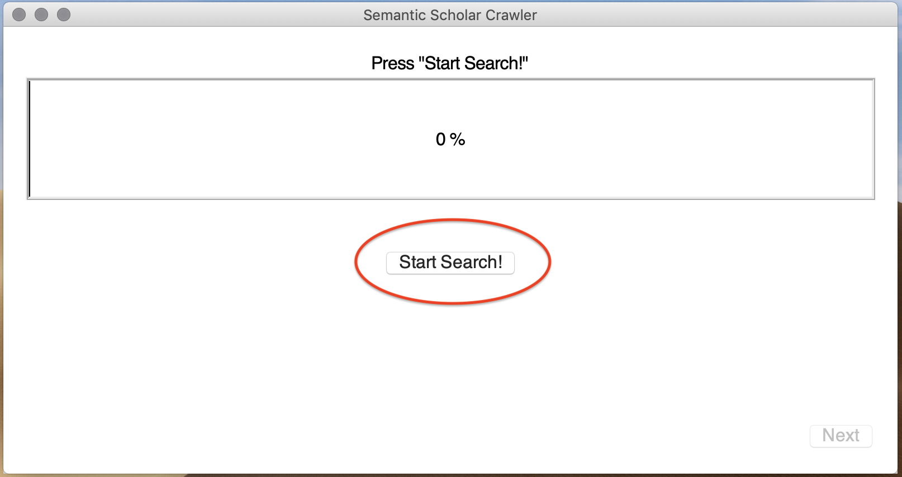
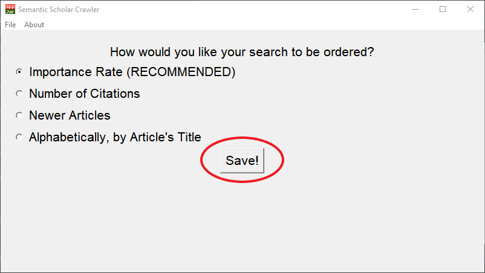
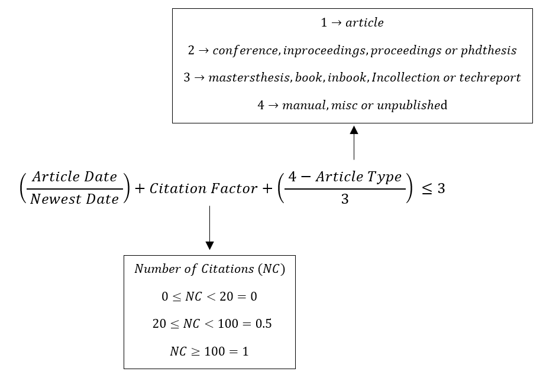
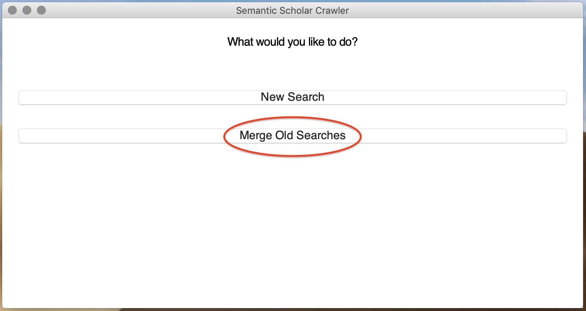
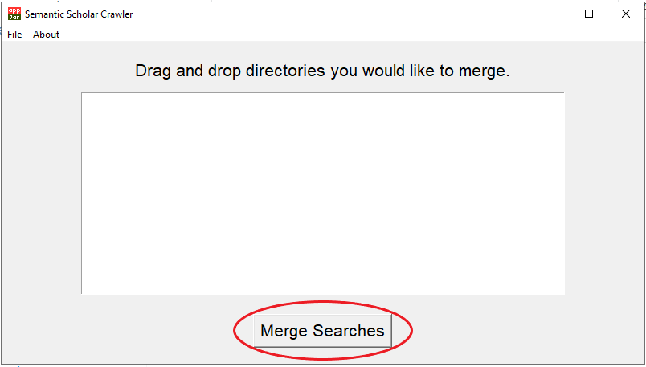

# SeleniumSemanticScraper
Automatically crawl meta data from papers from Semantic Scholar website, based on a given key phrase using Selenium WebDriver and saves it in a .xls (Excel) file. 

This program uses TKinter, wrapped with appJar as GUI.

# Running
This program can run in **Windows, Linux and MacOS**.
- Install the latest version of **Python 3** in your system.
- Install Google Tesseract (**[How To](https://github.com/tesseract-ocr/tesseract)**) (This part is optional for now!)
- You can install all the required dependencies by navigating via terminal/CMD to the folder where this project was 
downloaded and running the command: `pip install -r requirements.txt`
- Depending on your OS, you might need to install TKinter (**[How To](https://tkdocs.com/tutorial/install.html)**). This package is default in normal python installations, but
yours might not have it.
- Make sure you have **Google Chrome** installed (the program will open a headless version of Chrome and make the search on it)
- Run the file **Main.py** with the command `python Main.py` on your terminal or cmd.


# Searching

To perform your first search, click on the Button "New Search"


Enter your search phrase in the field (1). Select how many pages you would like to gather in the field (2) and 
press "Next" (3).



Start your search by pressing the button "Start Search!".

Your search will be made in the **[Semantic Scholar Website](https://www.semanticscholar.org)**. 
Each page selected will actually search for 3 pages. The first parameter will be the default search. The second 
parameter will be with the option "Newer Articles" selected in the Semantic Scholar website. The last parameter will 
be with the "Lit Review" option selected. Any duplicated article in the search will be considered only as one.



When your search is complete, a pop will show up, informing the time it took to make the search and how many articles
were gathered.

You will then be asked if you'd like to download all the available PDFs from your search. You can skip this part by 
pressing the "Skip" button. Otherwise, just click "Start Downloads!". When the downloads are done, you can click "Next".

After that you will be asked about how would you like to save your search.

- The first option uses an optimized algorithm for ordering your search
- The second option orders your search by Number of Citations
- The third option orders your search by Newest Articles
- The last option orders your search by Alpabetical order, using the Article's Title.

After selecting your option, press "Save!" and you will be shown a pop up telling your where the Excel file was saved.



If you choose the first option, your search will be saved using the equation below.



# Multiple Searches
If you'd like to merge multiple searches, generating only one ordered Excel File, you can choose
the "Merge Old Searches" button.



First, drag and drop all previous searches you would like to merge. Then press "Merge Searches".



After this, your will be taken to the Save Screen. It works just like in the normal search.

# Common errors

## Cannot find Chrome binary

This error occurs when the ChromeDriver cannot find the Chrome binary in the default location of your system.

To override the default Chrome binary, do as follows: 

* Open the ``SemanticScholarMetaCrawler.py`` file;
* Uncomment line 46 and replace it with your Chrome path.

```python
43      self.options.add_argument('--no-sandbox')
44      self.options.add_argument('--disable-gpu')
45
46      #self.options.binary_location = "C:\\Path\\To\\Chrome"
47
48      self.start_time = Timer.timeNow()
49      self.end_time = Timer.timeNow()
```

More info [here](https://stackoverflow.com/questions/50138615/webdriverexception-unknown-error-cannot-find-chrome-binary-error-with-selenium).