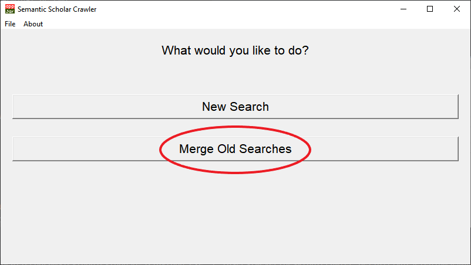
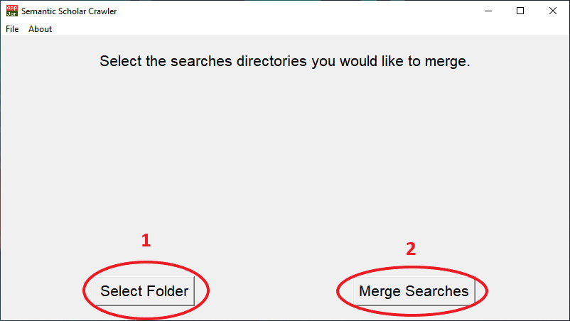

# SeleniumSemanticScraper
Automatically crawl meta data from papers from Semantic Scholar website, based on a given key phrase using Selenium WebDriver and saves it in a .xls (Excel) file. 

This program uses TKinter, wrapped with appJar as GUI.

# Running
This program can run in **Windows, Linux and MacOS**.
- Install the latest version of **Python 3** in your system.
- Make sure you have the following packages installed: **Selenium, xlsxwriter, pickle, TKinter, appJar and pathlib**. This can be done with PIP or any other Python packages manager.
- Make sure you have **Google Chrome** installed (the program will open a headless version of Chrome and make the search on it)
- Run the file **Main.py** with the command `python Main.py` on your terminal or cmd.

#Searching
To perform your first search, click on the Button ￿"New Search￿"

Enter your search phrase in the field (1). Select how many pages you would like to gather in the field (2) and 
press ￿"Next￿" (3).

Start your search by pressing the button ￿"Start Search!￿".

Your search will be made in the **[Semantic Scholar Website](https://www.semanticscholar.org)**. 
Each page selected will actually search for 3 pages. The first parameter will be the default search. The second 
parameter will be with the option ￿"Newer Articles￿" selected in the Semantic Scholar website. The last parameter will 
be with the ￿"Lit Review￿" option selected. Any duplicated article in the search will be considered only as one.

When your search is complete, a pop will show up, informing the time it took to make the search and how many articles
were gathered. After that you will be asked about how would you like to save your search.

- The first option uses an optimized algorithm for ordering your search
- The second option orders your search by Influence Factor
- The third option orders your search by Citation Velocity
- The forth option orders your search by Newest Articles
- The last option orders your search by Alpabetical order, using the Article￿'s Title.

After selecting your option, press ￿"Save!￿" and you will be shown a pop up telling your where the Excel file was saved.

If you choose the first option, you will have to select the Alphas for your search. For a equally balanced search, 
input 1 for all alphas. Do not use decimal number.

# Multiple Searches
If you￿'d like to merge multiple searches, generating only one ordered Excel File, you can choose
the ￿"Merge Old Searches￿" button.

First, click on the ￿"Select Folder￿" button (1). Select the folder in which your search was 
saved. Repeat this to add all the searches you￿'d like. Then press ￿"Merge Searches￿" (2).

Screen to choose the folder:

After this, your will be taken to the Save Screen. It works just like in the normal search.
